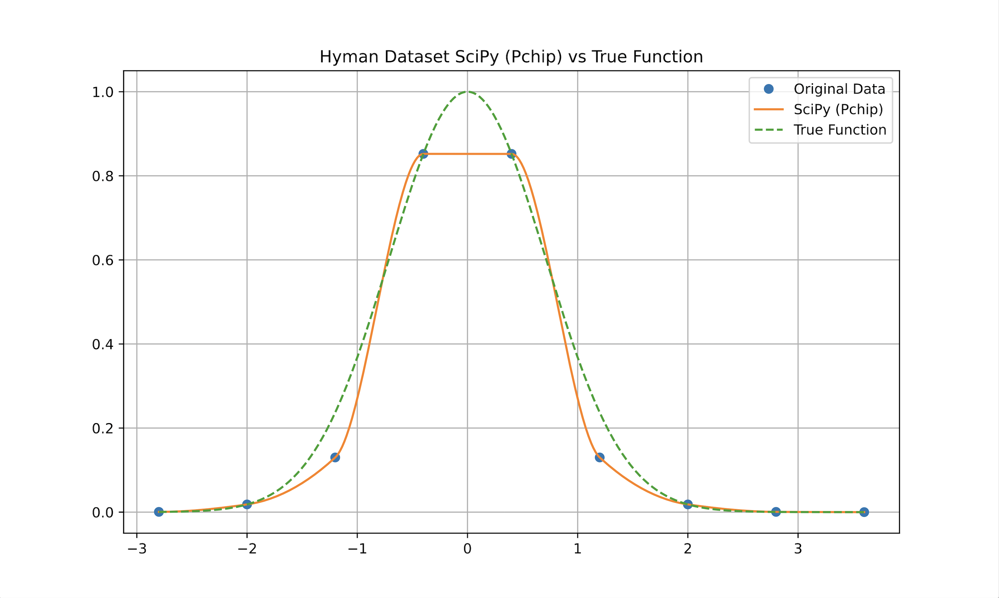

# Pchips

## Overview

This is a Python port, produced using [Gemini CLI](https://github.com/google-gemini/gemini-cli) in an afternoon, of the accurate monotone cubic interpolant [originally implemented in MATLAB here](https://github.com/vglazer/USRA/tree/master/interpolation). It's meant to serve as a drop-in replacement for SciPy's [PchipInterpolator](https://docs.scipy.org/doc/scipy/reference/generated/scipy.interpolate.PchipInterpolator.html).

All the logic is in [interpolate.py](src/pchips/interpolate.py). The main purpose of the [tests](tests) is to generate comparison plots.

The algorithm, due to [H. T. Huynh](https://scholar.google.com/citations?user=ZXhGCtwAAAAJ&hl=en), is described in this [NASA Technical Memo](https://ntrs.nasa.gov/citations/19910011517), which is self-contained and quite readable. A nearly identical version was later published in the [SIAM Journal on Numerical Analysis](https://epubs.siam.org/doi/10.1137/0730004).

## Quickstart

- Make sure you have [uv installed](https://docs.astral.sh/uv/getting-started/installation/)
- Clone the repo
- `cd pchips`
- `uv sync`
- `uv run pytest`
- Check out the comparison plots in the `plots` subdirectory

## Mathematical background

- Say that you have a bunch of discrete samples $\{(x_i, y_i)\}_{i = 0}^{n}$ which you want to interpolate on using some nice function $f: \mathbb{R} \rightarrow \mathbb{R}$ such that $f(x_i) = y_i, 0 \leq i \leq n$
- [Cubic splines](https://en.wikiversity.org/wiki/Cubic_Spline_Interpolation) are one popular option. They are 4th order accurate (i.e. the error term is $O(h^4)$ ) and quite smooth:
  - Their first derivative $f'$ is not only continuous, but also differentiable (i.e. $f \in C^2$)
  - However, cubic splines may "wiggle" by "overshooting" and "undershooting" the data. This is not visually pleasing and may be problematic for certain applications
- An alternative approach is to construct a [Hermite spline](https://en.wikipedia.org/wiki/Cubic_Hermite_spline), which will match not only the data but also its first derivative:
  - That is, we also have $f'(x_i) = \hat{f'}(x_i), 0 \leq i \leq n$, where $\hat{f'}$ is the approximate derivative of the function sampled to generate the data, produced using e.g. [Newton interpolation](https://en.wikipedia.org/wiki/Polynomial_interpolation#Newton_Interpolation)
  - If $\hat{f'}$ is 3rd-order accurate or higher then $f$ is 4th-order accurate, as with cubic splines. You give up some smoothness, though: while $f'$ is still continuous, it is no longer differentiable (i.e. $f \in C^1$)
  - Moreover, **Hermite interpolants are not guaranteed to preserve monotonicity**. Meaning, they may be increasing in regions where the data is decreasing and vice versa
- A number of approaches have been proposed for dealing with this, but they generally trade away accuracy in order to preserve monotonicity. For example, [PchipInterpolator](https://docs.scipy.org/doc/scipy/reference/generated/scipy.interpolate.PchipInterpolator.html) uses the method from [Fritsch and Butland](https://epubs.siam.org/doi/10.1137/0905021), which is only 2nd order accurate in general (i.e. no better than linear interpolation):
  - **Intuitively, the issue is that the interpolant _imposes_ monotonicty on the data rather than simply _preserving_ it**
  - This results in "slicing" near local maxima and minima, causing accuracy to degrade
  - The "Monotone Convex" spline introduced by [Hagan and West](https://www.deriscope.com/docs/Hagan_West_curves_AMF.pdf) in the context of forward curve construction also suffers from this problem
  - The modified Akima or ["Makima" interpolant](https://blogs.mathworks.com/cleve/2019/04/29/makima-piecewise-cubic-interpolation/), implemented by SciPy's [Akima1DInterpolator](https://docs.scipy.org/doc/scipy/reference/generated/scipy.interpolate.Akima1DInterpolator.html#scipy.interpolate.Akima1DInterpolator), produces a spline which "appears natural" and avoids slicing for non-monotone data. However, as far as I can tell, it does not guarantee 4th order accuracy. Here is Akima's [original paper](https://dl.acm.org/doi/pdf/10.1145/321607.321609).
- [H.T. Huynh's interpolant](https://ntrs.nasa.gov/api/citations/19910011517/downloads/19910011517.pdf), which is implemented in [interpolate.py](src/pchips/interpolate.py), effectively relaxes the monotonicty constraint near strict local extrema:
  - Depending on the approximation used for $\hat{f'}$, this results in a uniformly $O(h^3)$ or $O(h^4)$ accurate interpolant which preserves monotonicity without imposing it
  - It's quite nice to look at, as well
